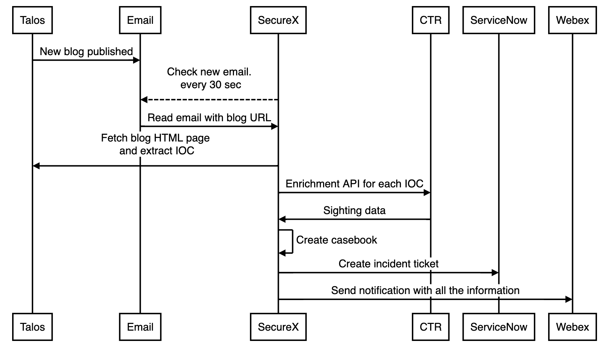
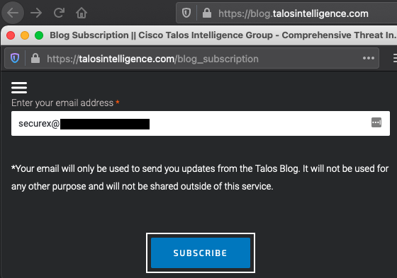
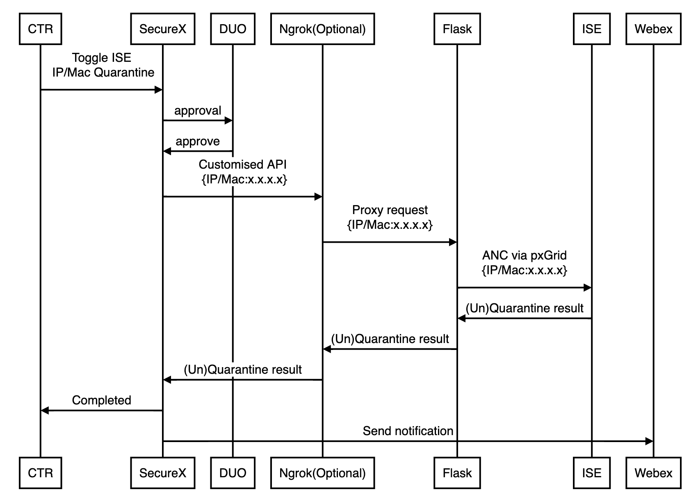
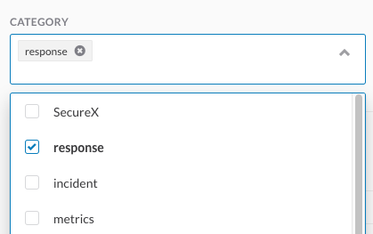
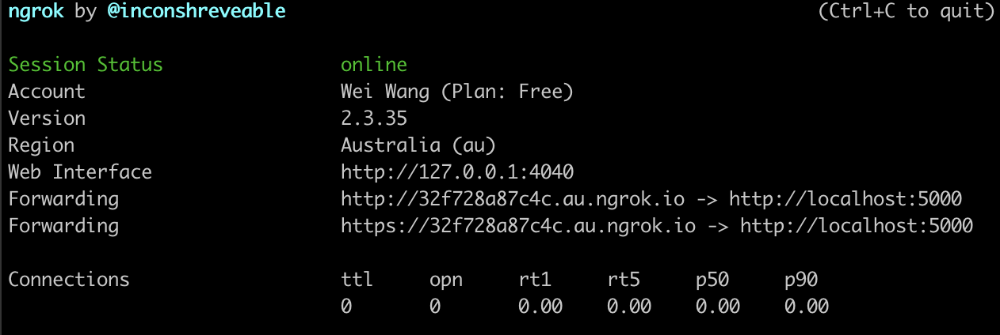
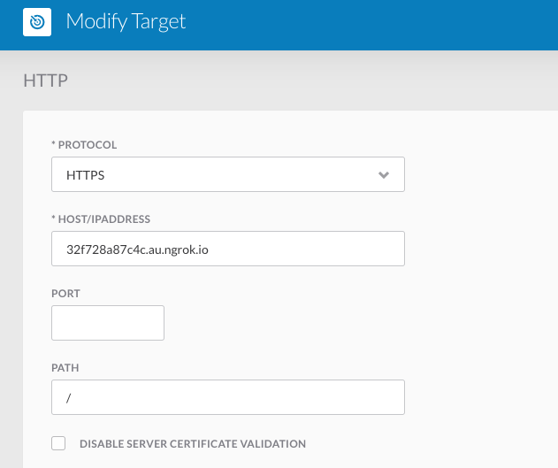
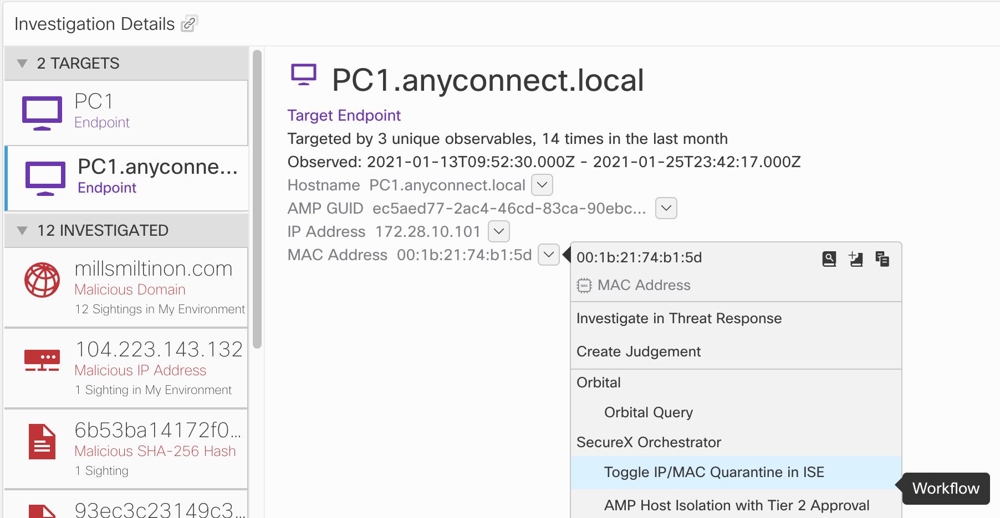

# SecureX-ISE-wf

To demostrate the power of Cisco DevNet and SecuerX,
I've created this use case with two workflows.
1. Cisco [Talos Blog](https://blog.talosintelligence.com/ "Talos Blog") email notification, which triggers CTR investigation with the creation of a new casebook and ServiceNow incident ticket. This is based on the [original workflow](https://github.com/CiscoSecurity/sxo-05-security-workflows/tree/Main/Workflows/0001-Talos-GetNewBlogPosts__definition_workflow_01FX7FQDZRDUX1TWgKJwTPBMaOWrgUOld2q "original workflow"), with enhancement to use email trigger instead of cron-like scheduler.
2. SecureX response workflow, which triggers ISE quarantine/un-quarantine via pxGrid ANC for those targets found from the workflow above.


------------

## Workflow 1 - New Talos Blog Email Workflow


**Prerequisites:**
1. An email account that supports either POP3 or IMAP. A Gmail account is used as an example in this case.
2. Cisco SecureX Account
3. Import [0002-Talos-SingleBlogPostToCTRCasebook](https://github.com/CiscoSecurity/sxo-05-security-workflows/tree/Main/Workflows/0002-Talos-SingleBlogPostToCTRCasebook__definition_workflow_01KEM2V2JAIPS3zmyEiCmuy3kvr3wxHrEuJ "0002-Talos-SingleBlogPostToCTRCasebook") from github with all dependencies.
4. Cisco Webex Team Account (Optional), this is used to receive messages from the workflow)

### Installation Steps
Please follow the below steps exactly to get started!
1. Subscribe to Talos Blog feed [email notification](https://www.talosintelligence.com/blog_subscription "email notification")



2. Import ["Check New Talos Blog Email.json"](https://github.com/weiwa6/SecureX-ISE-wf/blob/main/Check%20New%20Talos%20Blog%20Email.json) to SecureX as a new workflow

3. Update the Email trigger. See documents of [email events](https://ciscosecurity.github.io/sxo-05-security-workflows/events/email) and [triggers](https://ciscosecurity.github.io/sxo-05-security-workflows/workflows/triggers)

4. Send a test email with a Talos blog link and check if the script is triggered.
(Note it could be any security intelligence feed url after modifying the workflow regex)

------------

## Workflow 2 - ISE Quarantine Workflow

**Prerequisites:**
1. Access to ISE with ANC polices configured
2. Prepare ISE pxGrid certificates as per [instruction](https://github.com/cisco-pxgrid/pxgrid-rest-ws/blob/master/python/README.txt "instruction")
3. Download [pxgrid-rest-ws](https://github.com/cisco-pxgrid/pxgrid-rest-ws "pxgrid-rest-ws") with [securex_ise.py](https://github.com/weiwa6/SecureX-ISE-wf/blob/main/securex_ise.py "securex_ise.py")
4. Ngrok (Optional, used to bypass opening firewall ports to expose Flask app)
5. Create DUO application as ["Partnet Auth API"](https://duo.com/docs/authapi)
6. Cisco Webex Team Account (Optional), this is used to receive messages from the workflow)


### Installation Steps

1. find config.py under pxgrid-rest-ws/python and update ISE credentials. e.g.
```python
class Config:
    def __init__(self):
        parser = argparse.ArgumentParser()
        parser.add_argument(
            '-a', '--hostname', help='pxGrid controller host name (multiple ok)', action='append', default=["Your ISE node IP address"])
        parser.add_argument('-n', '--nodename', help='Client node name', default="Your pxGrid Node Name")
        parser.add_argument('-w', '--password', help='Password (optional)')
        parser.add_argument('-d', '--description',
                            help='Description (optional)')
        parser.add_argument(
            '-c', '--clientcert', help='Client certificate chain pem filename (optional)', default="Your certificate.pem")
        parser.add_argument('-k', '--clientkey',
                            help='Client key filename (optional)', default="Your certificate.key")
        parser.add_argument('-p', '--clientkeypassword',
                            help='Client key password (optional)', default="Your certificate password")
        parser.add_argument('-s', '--servercert',
                            help='Server certificates pem filename', default="Your pxGrid CA.pem")
							...
```
2. Approve pxGrid client in ISE (Only required once)
3. Import Toggle IP_MAC Quarantine in ISE.json to your SecureX workflow
4. Make sure "response" is enabled as the category



5. Run ngrok on the same computer with securex_ise.py
```
./ngrok http 5000
```



6. Update SecureX Ngrok target URL using the output from the command above.



7. Run securex_ise.py
8. Test the workflow with the SecureX pivit menu

